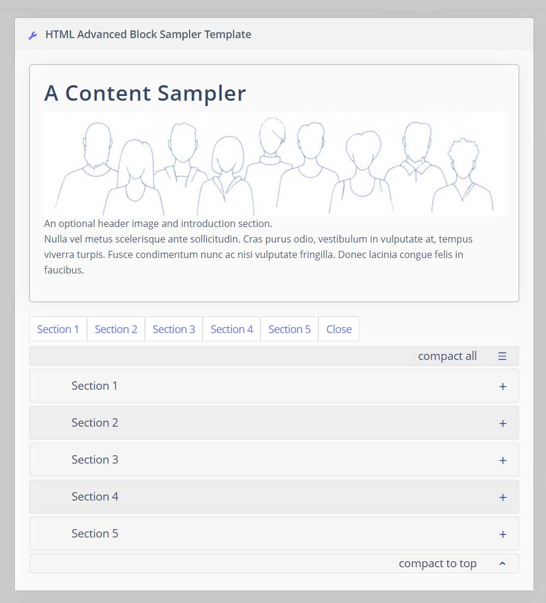

[](http://www.gnu.org/licenses/gpl-3.0)

# HTML Block Advanced


An HTML Block using collapsible sections and enabling advanced styles and features. This module an extension of the default webtrees HTML Block. It's templates are structured in multiple collapsible sections. The Starter template is a sampler of features and styles suitable for a family history or biography. There is also a ReadMe section.


Compatibility: webtrees 2.1.20
Requires webtrees 2.1.20 for extended allowed classes and styles.   

## Rationale
This module was designed to better display content such as an extensive family history narrative that would otherwise produce one very long page.

## Installation

Install and enable the module:
* Download and unzip the release package.
* Place the html-block-advanced folder inside modules_v4 folder of your webtrees installation.
* Open the control panel, Modules | Home page | Blocks, make sure "enabled" is checked next to the html-block-advanced module, click "Save"

Note: Here you can also change the access level (recommended: Show to visitors) and order (recommended as the first tab to display)

## Upgrading
To upgrade an existing installation of the module, simply replace the html-block-advanced folder inside the modules_v4 folder with the new one.

## Loading starter content

Choose Sampler from the Template dropdown. This will load the content of a demonstration template that can be edited and altered to suit your needs. This sampler template has collapsable sections. Add a **Title** and **Save**.<br>

The **Vanilla** template contains only the collapsible sections with Lorem ipsum placeholder text for a clean start.<br> 
More templates to come.

<br/>
View the result in the HTML Accordion Block you have added to your **My Page** or **Tree Home Page** from **My pages** menu - **Customise this page**.

## Customizing Content



### Editing content and adding sections

* You can use the WYSIWYG editor to add or remove content.
* If you are comfortable with html code, use the [source] tab to edit and extend content.
* To add new sections, use this example code.

 <span style="color:#c05050;font-size:1.2em"> **Important!** <br>**It is essential that the anchor href \# and div id use the same UNIQUE identifier - unique from all other sections.<br> 
 If more than one complete HTML Block Advanced is added to a page then all anchor href # and div ids will need to be changed so as to be different to the other block.** </span> 
 
```
<div class="accord__item">
    <a class="accord__item__title" href="#item10">Add New Sections</a>
    <div class="accord__item__content" id="item10">
        <h2>New Section Title</h2>
        <hr>
        <p>Content here</p>
    </div>
</div>
```            
add new sections before the three closing divs

>               </div>
>           </div>
>       </div>

## Backup
It is good practice to make a backup copy of your edited content. It is easily possible to unintentionally overwrite your custom content by again selecting template from the dropdown. As long as you don't **Save**, selecting **Cancel** at this point will leave your content in place. The WYSIWYG editor also is rather unforgiving of custom code errors so while editing, regular backups are always a good idea.

To backup your content, select the [Source] tab in the editor and copy the source HTML code. This can be kept as a plain text file and pasted back into the editor source to restore.  
